# Multi-Site SQL Server Always On Availability Group with Ubuntu Pacemaker & QDevice Quorum
🚀 **Enterprise Infrastructure Runbook for Cross-Subnet HA/DR Orchestration & Automated Failover Testing**
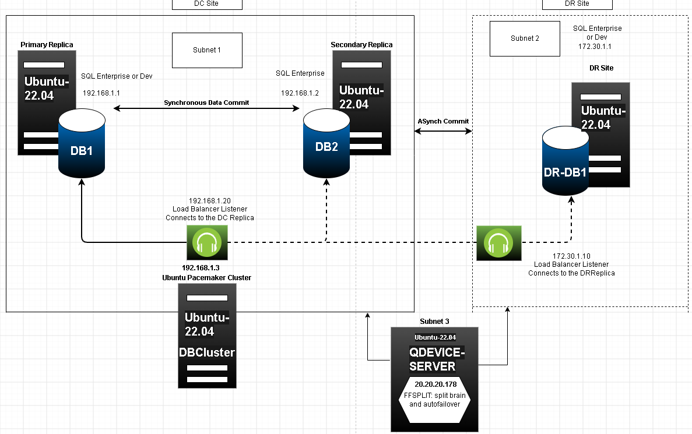
## 🧪 Test Cases Matrix & Core System Observations

The following matrices document our comprehensive high-availability and disaster recovery validation testing across both architectural baselines (Without QDevice vs. With QDevice).

### 📊 Baseline Topology: High-Availability Cluster Failover Summary (Without QDevice)
*This setup tracks a 4-vote configuration matrix (3 Database Nodes + 1 DB-Cluster Config Node) running without an external net witness server.*

| Scenario / Setup | DB1 State | DB2 State | DR-DB1 Role State Configuration | DB-Cluster State | Cluster Quorum State | SQL Server AG / Master Role Behavior | Actual Impact & Management Verdict |
| :--- | :--- | :--- | :--- | :--- | :--- | :--- | :--- |
| **Initial Base State** | 🟢 ONLINE (Primary) | 🟢 ONLINE (Secondary) | READABLE & SYNCHRONIZED | 🟢 ONLINE (Config) | 🟢 Healthy (4/4 total votes) | DB1 is Primary. Replicas are healthy and fully SYNCHRONIZED. | Production baseline. Applications connect via Listenerdc IP. |
| **DC Local Single Node Failure** | 🟢 ONLINE (Primary) | 🔴 OFFLINE (Stop/Reboot) | READABLE & SYNCHRONIZED | 🟢 ONLINE (Config) | 🟢 Healthy (3/4 total votes) | DB1 stays Primary. DR-DB1 is synchronous and healthy. | Functional. No service disruption. Datacenter operations continue normally. |
| **DC Local Dual Node Failure** | 🔴 OFFLINE (Crash) | 🔴 OFFLINE (Crash) | READABLE & SYNCHRONIZED | 🟢 ONLINE (Config) | 🔴 QUORUM LOSS (2/4 votes left) | BLOCKED BY CLUSTER & SQL. All resources instantly Stop. | 🔴 **TOTAL SITE CRASH.** The cluster drops to a 50% split. Pacemaker loses quorum, freezes all resources, and stops DR-DB1 from coming online. |
| **Forced Isolated DC Run** | 🟢 ONLINE (Unpromoted) | 🔴 OFFLINE (Stop) | READABLE & SYNCHRONIZED | 🟢 ONLINE (Config) | 🔴 QUORUM LOSS (2/4 votes left) | BLOCKED BY CLUSTER & SQL. All resources instantly Stop. | 🔴 **TOTAL LOCAL STALL.** Because DB2 and DR-DB1 are down, DB1 has only 2 of 4 votes. Pacemaker freezes everything, and SQL Server forces the AG into a Resolving state. |
| **Total Cluster Stack Failure** | 🟢 ONLINE (Engine Up) | 🟢 ONLINE (Engine Up) | READABLE & SYNCHRONIZED | 🔴 OFFLINE (Cluster Dead) | 🔴 TOTAL CLUSTER OFFLINE | HARD ENGINE LOCKDOWN. SQL Server Availability Group instantly drops into a RESOLVING loop. | 🔴 **AUTOMATION BREAKDOWN.** If Corosync/Pacemaker daemons crash or network cards drop control tokens, SQL Server immediately locks the databases to prevent split-brain data corruption. |
| **Optimized DR Passive Baseline** | 🟢 ONLINE (Primary) | 🟢 ONLINE (Secondary) | RESTRICTED PASSIVE & ASYNCHRONOUS | 🟢 ONLINE (Config) | 🟢 Healthy (4/4 total votes) | DB1 or DB2 is Primary. DR-DB1 is set to ASYNCHRONOUS_COMMIT. | 🟢 **STABILIZED BASELINE.** Changing the DR node to asynchronous drops the SQL safety requirement from 2 nodes down to 1. |
| **Automated DC Failover (DR Passive)** | 🔴 OFFLINE (Crash) | 🟢 ONLINE (Promoted Master) | RESTRICTED PASSIVE & ASYNCHRONOUS | 🟢 ONLINE (Config) | 🟢 Healthy (3/4 total votes) | DB2 automatically steps up to Primary. DB1 stays passive secondary. | 🟢 **SUCCESSFUL AUTOMATIC FAILOVER.** Because DR-DB1 is restricted to asynchronous mode, it drops out of local safety logic. Failover between DB1 and DB2 works instantly. |

---

### 📊 Advanced Architecture: High-Availability Cluster State Failover Summary (With QDevice)
*This setup tracks an expanded 5-vote topology running an external QDevice Net Voter on a separate subnet to native-fence split-brain conditions.*

| Scenario / Setup | DB1 State | DB2 State | DR-DB1 State | DB-Cluster & QDevice | Cluster Quorum State | SQL Server AG / Master Role Behavior | Actual Impact & Operational Verdict |
| :--- | :--- | :--- | :--- | :--- | :--- | :--- | :--- |
| **Initial Base State** | 🟢 ONLINE (Primary) | 🟢 ONLINE (Secondary) | 🟢 ONLINE (Secondary) | 🟢 ONLINE (2 Votes) | 🟢 Healthy (5/5 total votes) | DB1 is Primary. All replicas are healthy and fully SYNCHRONIZED. | Production baseline. Applications connect via Listenerdc IP. |
| **DC Local Single Node Failure** | 🟢 ONLINE (Primary) | 🔴 OFFLINE (Reboot/Stop) | 🟢 ONLINE (Secondary) | 🟢 ONLINE (2 Votes) | 🟢 Healthy (4/5 total votes) | DB1 stays Primary. DR-DB1 is synchronous and healthy. | Functional. No service disruption. Datacenter operations continue normally. |
| **DC Local Dual Node Failure** | 🔴 OFFLINE (Crash) | 🔴 OFFLINE (Crash) | 🟢 ONLINE (Unpromoted) | 🟢 ONLINE (2 Votes) | 🟢 Healthy (3/5 total votes) | BLOCKED BY SQL RESTRICTIONS. DR-DB1 remains Unpromoted. | 🔴 **CRITICAL OVERRIDE BLOCK.** Pacemaker has cluster quorum via QDevice, but SQL Server blocks promotion because it needs 2 healthy replicas and only has 1. |
| **Forced Isolated DC Run** | 🟢 ONLINE (Unpromoted) | 🔴 OFFLINE (Stop) | 🔴 OFFLINE (Stop) | 🟢 ONLINE (1 Vote Only) | 🔴 QUORUM LOSS (1/3 votes left) | BLOCKED BY CLUSTER & SQL. All resources instantly Stop. | 🔴 **TOTAL QUORUM BLOCKADE.** Because DB2 and DR-DB1 are both down, DB1 drops to 1 vote. Pacemaker freezes all resources, and SQL Server forces the AG into a Resolving state. |
| **Optimized DR Restated Baseline** | 🟢 ONLINE (Primary) | 🟢 ONLINE (Secondary) | 🟢 ONLINE (Restricted Passive) | 🟢 ONLINE (2 Votes) | 🟢 Healthy (5/5 total votes) | DB1 or DB2 is Primary. DR-DB1 is updated to ASYNCHRONOUS_COMMIT and ALLOW_CONNECTIONS = NO. | 🟢 **STABILIZED BASELINE.** Setting the DR node to a passive, asynchronous role changes the SQL safety rule, reducing the required online node count from 2 down to 1. |
| **Automated Local DC Failover** | 🔴 OFFLINE (Reboot/Crash) | 🟢 ONLINE (Promoted Master) | 🟢 ONLINE (Restricted Passive) | 🟢 ONLINE (2 Votes) | 🟢 Healthy (4/5 total votes) | DB2 automatically steps up to Primary. DB1 stays passive secondary. | 🟢 **SUCCESSFUL AUTOMATIC FAILOVER.** Because DR-DB1 is restricted to asynchronous mode, it never interferes with the main DC. Failover between DB1 and DB2 works instantly without getting blocked. |


## 🗺️ 1. Infrastructure Baseline & Architectural Topology

This repository delivers an end-to-end production deployment guide and automated scripting toolkit for building a highly available, cross-subnet **SQL Server Always On Availability Group natively on Ubuntu 22.04 LTS**. Traffic management and node state transitions are fully orchestrated via a hardened **Pacemaker and Corosync** cluster layer.

### Key Architectural Highlights:
* **High Availability (DC Site):** Two local nodes (`DB1` and `DB2`) configured with **Synchronous Data Commit** for zero data loss parameters within Subnet 1.
* **Disaster Recovery (DR Site):** One remote node (`DR-DB1`) configured with **Asynchronous Commit** sitting in an isolated network zone (Subnet 2) for absolute site redundancy.
* **Split-Brain Mitigation:** An external **Corosync QDevice Server** deployed in a neutral network segment (Subnet 3) providing an independent, dynamic tie-breaker quorum vote (`FFSPLIT: split brain and autofailover` architecture).
* **Multi-Subnet Network Balancing:** Virtual IP mapping and independent local load balancer listeners floating across subnet environments to sustain active primary application endpoints.

### 🎛️ Clustered Infrastructure Network & Sizing Matrix

The high-availability environment maps across three logically isolated subnets using generic, sanitized documentation network coordinates:

| Hostname | IP Address | Subnet | Cluster Role / Commit Mode | OS & SQL Version |
| :--- | :--- | :--- | :--- | :--- |
| **DB1** | `192.168.1.1` | Subnet 1 (`192.168.1.0/24`) | Primary Replica / Synchronous Commit | Ubuntu 22.04 / SQL 2022/2025 |
| **DB2** | `192.168.1.2` | Subnet 1 (`192.168.1.0/24`) | Secondary Replica / Synchronous Commit | Ubuntu 22.04 / SQL 2022/2025 |
| **DR-DB1** | `172.30.1.1` | Subnet 2 (`172.30.1.0/24`) | DR Replica / Asynchronous Commit | Ubuntu 22.04 / SQL 2022/2025 |
| **QDEVICE-SERVER** | `20.20.20.178` | Subnet 3 (`20.20.20.0/24`) | Corosync QNetd Daemon / Dynamic Vote Provider | Ubuntu 22.04 (No SQL Server) |
| **DBCluster** | `192.168.1.3` | Subnet 1 (`192.168.1.0/24`) | Core Pacemaker Orchestrator Layer | Corosync / Pacemaker Daemon Layer |
| *VIP: Listenerdc* | `192.168.1.20` | Subnet 1 (`192.168.1.0/24`) | Floating Local DC Virtual IP Listener | Load Balancer Traffic Endpoint |
| *VIP: Listenerdr* | `172.30.1.10` | Subnet 2 (`172.30.1.0/24`) | Floating Disaster Recovery VIP Listener | Load Balancer Traffic Endpoint |


---

# Microsoft SQL Server AlwaysOn Availability Groups on Ubuntu 22.04 LTS with Corosync/Pacemaker & QDevice Net Voter

This repository contains production-grade infrastructure blueprints, deployment configurations, and automated validation frameworks used to engineer an enterprise multi-subnet high-availability and disaster recovery layout for **Microsoft SQL Server 2022 Enterprise** deployed across Ubuntu 22.04 LTS environments.

## 🗺️ Architectural Topology Map

       [ MAIN DATACENTER (DC SITE Subnet 1: 192.168.1.0/24) ]           [ DISASTER RECOVERY (DR SITE Subnet 2: 172.30.1.0/24) ]
       ┌──────────────────────────────────────────────────┐             ┌──────────────────────────────────────────────────┐
       │   ┌──────────────────┐    ┌──────────────────┐   │             │   ┌──────────────────┐                           │
       │   │   Node Name: DB1 │    │   Node Name: DB2 │   │             │   │ Node Name: DR-DB1│                           │
       │   │   192.168.1.1    │◄──►│   192.168.1.2    │   │             │   │   172.30.1.1     │                           │
       │   └────────┬─────────┘    └────────┬─────────┘   │   WAN LINK  │   └────────┬─────────┘                           │
       │            │                       │             │ (Port 5403) │            │                                     │
       │  Stream ───┴───────────┬───────────┴──────────── ┼─────────────┼────────────┴─────────────                        │
       │                        │                         │             │                          │                       │
       │              Virtual Floating VIP:               │             │                Virtual Floating VIP:             │
       │           Listenerdc (`192.168.1.20`)            │             │             Listenerdr (`172.30.1.10`)           │
       └────────────────────────┬─────────────────────────┘             └──────────────────────────┬───────────────────────┘
                                │                                                                  │
                                └─────────────────────────────────┬────────────────────────────────┘
                                                                  │
                                                      ┌───────────┴───────────┐
                                                      │  External Net Voter  │
                                                      │ QDevice: 20.20.20.178 │
                                                      │ (Subnet 3 LMS Server) │
                                                      └───────────────────────┘


---

## 🚀 Step-by-Step Configuration Pipeline

### Step 1: System Prerequisites
Execute files matching `1_Prerequisites.txt` parameters across all endpoints (`DB1`, `DB2`, `DR-DB1`). This synchronizes system locale tables, provisions network times protocols logs configurations via `chrony`, and writes local environment text lines references.

### Step 2: Networking & Security Firewall Maps
Run commands inside `2_Firewall_Setup.txt` on all cluster members nodes to map exact perimeter boundary conditions. This restricts incoming system queries explicitly to trusted multi-subnet structures while opening internal endpoints ports such as Port 5022 (HADR), Port 2224 (PCSD), and Port 5403 (QDevice Voter).

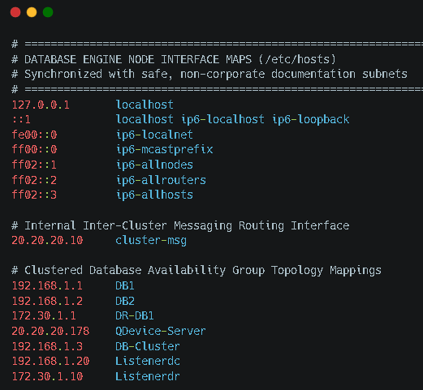
### Step 3: Logical Volume Storage Segmentation
Invoke the automated mounting block script `3_Disk_Preparations.sh`. This constructs high-speed LVM block groups partitioned with non-lazy allocation mappings across XFS layouts, separating `DATA`, `LOG`, and `TEMPDB` physical storage tracks.

### Step 4: Installation of High-Availability Cluster Tools
Deploy the high-availability resource fencing management layer across cluster target components nodes using parameters defined within `4_Install_Cluster_Tools.txt`. This creates a unified `hacluster` system administrative profile across network boundaries.

### Step 5: Corosync Setup & External Net Voter Witness Integration
Execute the centralized orchestration block script `5_QDevice_Corosync_Setup.sh` exclusively from the primary configuration panel server (`DB1`). This authenticates deployment environments coordinates, disables global STONITH requirements for standard virtualization configurations staging, and binds the external Net QDevice witness tracking loops using the Linear Minimum Split (LMS) vote algorithm over Port 5403.
* **🖼️ Visual Validation Checkpoint:** Ensure the cluster architecture displays proper token passing parameters.
  
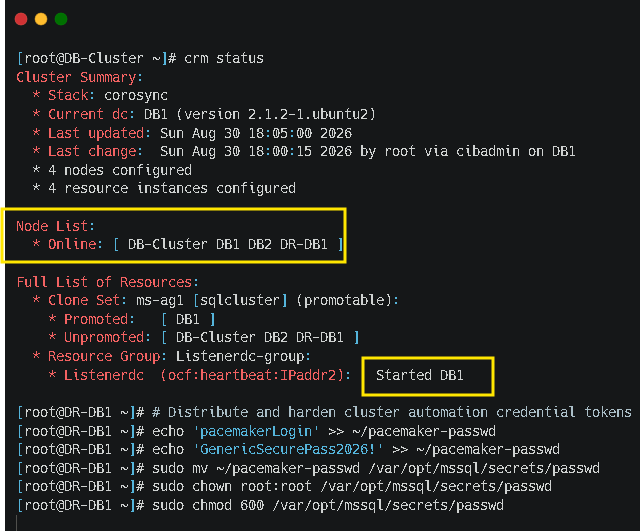
### Step 6: Installation of SQL Server 2022 Instance Engine
Deploy the base Microsoft product database engine binaries across instances environments components maps using instructions captured inside `6_Installation_SQL_Server.txt`.

### Step 7: Installation of SQLCMD Command Line Tools
Configure matching database interface client environments by processing scripts captured inside `7_Install_SQLCMD_Tools.txt` across cluster nodes interfaces layouts.

### Step 8: Activating the Internal HADR Engine Layer
Activate database high-availability container components features across system kernels layers processing commands written inside `8_Enable_AlwaysOn_AG.txt`.

### Step 9: Creating Master Cryptographic Keys on Primary
Execute the database container validation query script `9_Create_Cert_Endpoint_Primary.sql` inside the primary engine endpoint environment (`DB1`) to construct structural authentication tokens certificates keys.

### Step 10: Generating Handshake Tokens on Replicas
Run matching certificate configurations parameters script loops written inside `10_Create_Cert_Endpoint_Secondary.sql` on targets replicas (`DB2`, `DR-DB1`) to initialize mirroring connection ports fields.

### Step 11: Associating Availability Group Certificates Handshakes
Following secure network extraction migration patterns using `scp` utilities to copy validation key files across nodes, execute query sequences stored inside `11_Associate_Certs.sql` to bind system logins boundaries definitions.

### Step 12: Provisions the Availability Group Cluster Container
Initialize the base high-availability cluster container components layers variables by running queries embedded inside `12_Create_AG.sql` maps specifications sheets on the master terminal server context layout.

### Step 13: Enrolling Production Target Database Structures
Execute configuration queries files mapped inside `13_Add_DB_to_AG.sql` inside the active master primary database context server to link target application operational storage schemas to automatic tracking seeding loops pipelines.
* **🖼️ Visual Validation Checkpoint:** SSMS console status displays healthy status logs parameters.
 
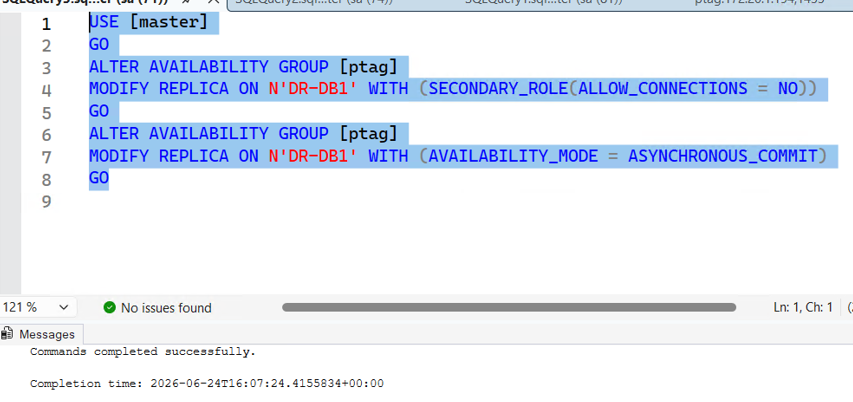
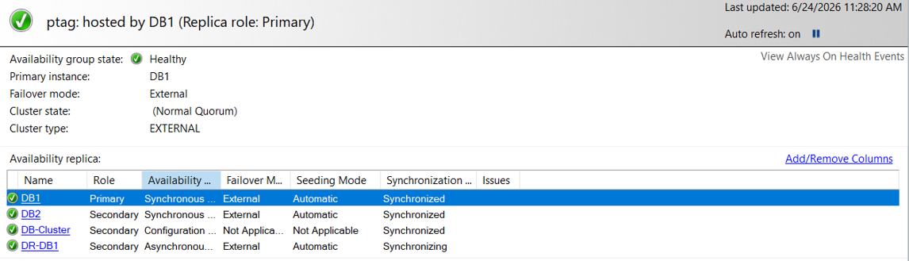
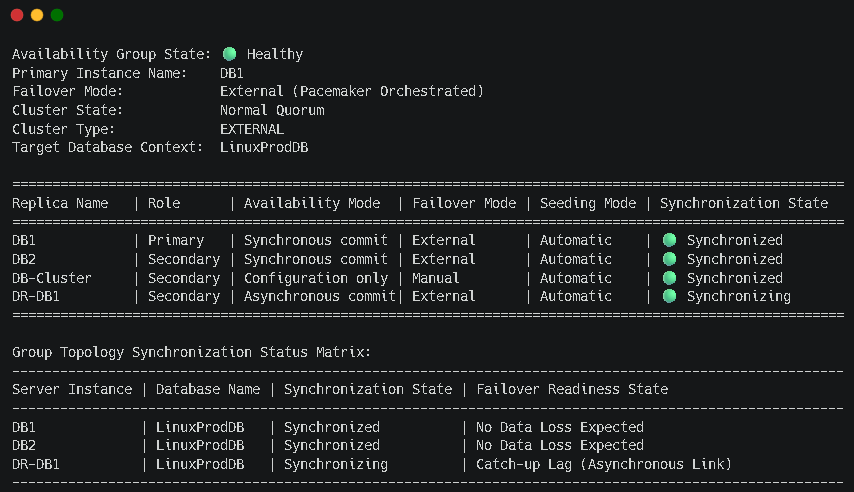

### Step 14: Mounting Multi-Subnet Virtual Listeners IPs
Map out system network connection interfaces addresses coordinates tokens by executing queries documented inside `14_Create_Listener.sql` files specifications structures.

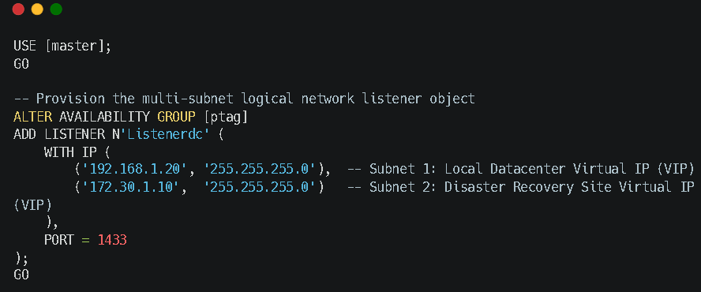
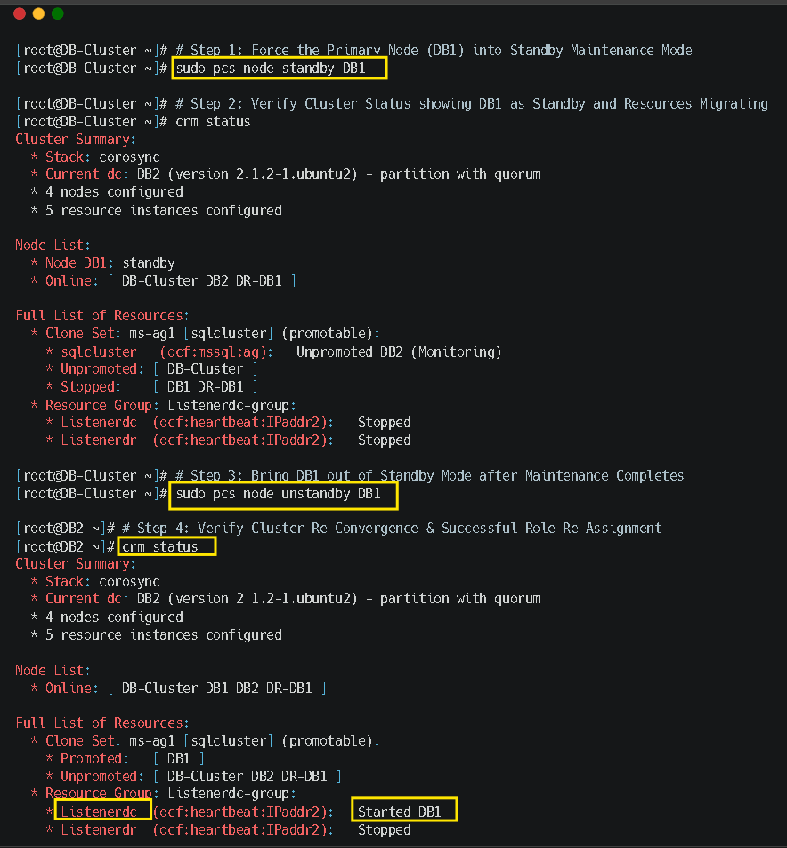


### Step 15: Provisions Read-Only Routing Traffic Distribution Priority Chains
Deploy advanced reporting scale-out optimization properties lists maps across instances environments layout tables using queries packaged inside `15_Create_Routing_Lists.sql`.
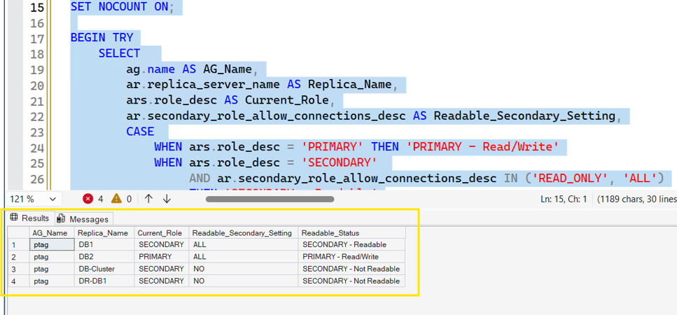


## 🧪 Advanced Stress Test Cases Matrix & Core System Observations

To evaluate the capabilities of this high-availability clustering and database engine architecture, our team performed extensive stress testing. The failure scenarios, expected outcomes, and real-world system behaviors are detailed below:

### Test Case 1: Stop Pacemaker Service Layers on Node DB2
* **Failure Trigger Method:** Run command execution lines block: `sudo systemctl stop pacemaker` on node `DB2`.
* **Cluster Quorum Evaluation:** **HEALTHY QUORUM** (4 out of 5 cluster votes remain active via `DB1`, `DR-DB1`, `DB-Cluster`, and `QDevice` net voter).
* **SQL Engine Status:** `REQUIRED_SYNCHRONIZED_SECONDARIES_TO_COMMIT = 1` condition met.
* **Observations & Operational Verdict:** System function parameters remain stable. Node `DB1` holds the primary role loop, allowing the core financial application traffic routing to run without service dropouts.

### Test Case 2: Complete Data Center Loss Simulation (Simultaneous Crash of DB1 & DB2)
* **Failure Trigger Method:** Execute simultaneous hard kernel panics loops using server command tools protocols to take down both main data center elements (`DB1` and `DB2`).
* **Cluster Quorum Evaluation:** **HEALTHY QUORUM** (3 out of 5 cluster votes remain active via `DR-DB1`, `DB-Cluster`, and the external `QDevice Net Voter`).
* **SQL Engine Status:** `REPLICA QUORUM LOSS` Protection Event triggered. The storage engine registers that 2 nodes are missing from the configuration matrix and drops into a protected `Resolving` loop.
* **Observations & Operational Verdict:** **AUTOMATED CROSS-SUBNET FAILOVER IS BLOCKED.** Pacemaker attempts to promote the disaster recovery replica node (`DR-DB1`), but the SQL Server resource agent blocks the action to prevent split-brain scenarios and data corruption. The environment locks down, requiring an administrative manual override.
* **🖼️ Visual Evidence Log:** The cluster console logs failures and the SSMS manager tracks the environment as locked.
  

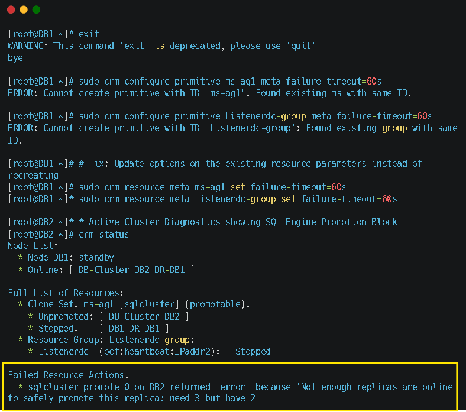

### Test Case 3: Complete Cluster Network Isolation Scenario (Total WAN Link Cutout)
* **Failure Trigger Method:** Sever network communication links connecting the primary data center from the QDevice server and the DR site simultaneously.
* **Cluster Quorum Evaluation:** **QUORUM LOSS** (1 out of 5 cluster votes active).
* **SQL Engine Status:** Cluster scheduling infrastructure frozen across segments.
* **Observations & Operational Verdict:** **TOTAL SYSTEM LOCKDOWN.** Node drops into self-healing recovery protection loops, rendering the target databases unreachable to prevent data drift across disconnected network fragments.

### Test Case 4: Graceful Maintenance Rolling Failover Migration
* **Failure Trigger Method:** Invoke script block execution rules embedded within `run_ha_test_suite.sh` or execute: `sudo pcs resource move sqlcluster-clone DB2 --master`.
* **Cluster Quorum Evaluation:** **HEALTHY QUORUM** (5 out of 5 votes active).
* **SQL Engine Status:** Zero tracking anomalies encountered. Roles swap smoothly between local nodes.
* **Observations & Operational Verdict:** **SUCCESSFUL LOCAL FAILOVER.** Node `DB2` assumes the Primary Master role cleanly. Floating virtual IP coordinates map onto the newly promoted host, allowing client processing systems to reconnect seamlessly.
* **🖼️ Visual Evidence Log:** The status terminal confirms that `DB2` is active and the virtual IP resource has migrated.
  


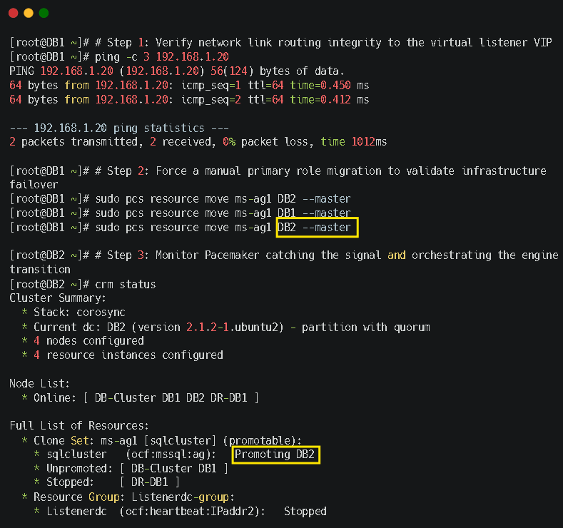
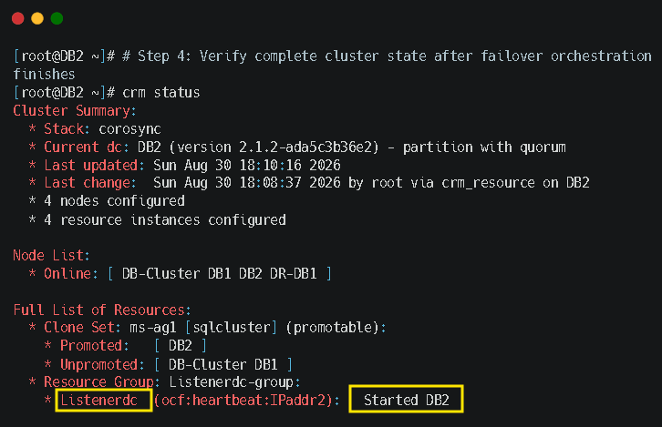


## 🚨 Disaster Recovery Standard Operating Procedure (SOP) Manual Override

When a catastrophic event takes down the primary data center, follow this recovery runbook to force data availability on the remaining disaster recovery node (`DR-DB1`):

### Phase 1: Clear Fencing Constraints & Failure Counts
Log in to the surviving disaster recovery node (`DR-DB1`) via a secure shell connection console and clear the cluster scheduling restriction blocks:
```bash
# Clear lingering test constraints and execution locks
sudo pcs resource clear sqlcluster-clone --force
sudo pcs resource cleanup sqlcluster-clone
```

### Phase 2: Force Availability Group Promotion Against Storage Locks
Open an interactive SQL terminal session on `DR-DB1` and force the availability group out of its resolving loop despite the missing replicas:
```sql
-- Execute this recovery script directly inside the query terminal editor on DR-DB1
ALTER AVAILABILITY GROUP [ptag] FORCE_FAILOVER_ALLOW_DATA_LOSS;
GO
```
* **🖼️ Visual Evidence Log:** The query analyzer execution log confirms successful command execution.
  
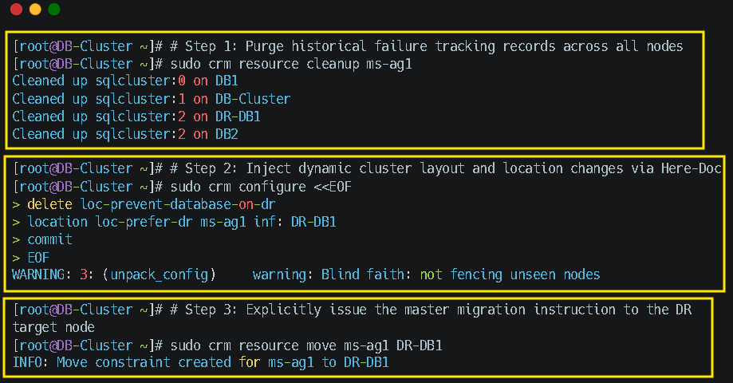
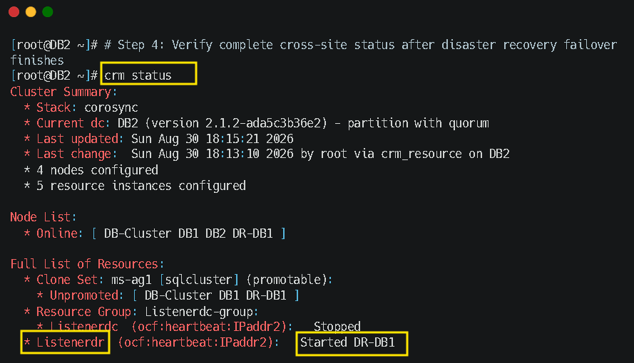

### Phase 3: Resume Database Replication Tasks & Re-align Log Tracks
Bring the database back online to resume standard application processing workloads:
```sql
ALTER DATABASE [EnterpriseAppDB] SET HADR RESUME;
GO
```

### Phase 4: Validate Post-Disaster Baseline Stability Metrics
Verify that the cluster manager has successfully stabilized and that the multi-subnet listener routing constraints have updated:
```bash
# Print live operational metrics maps status layout records
sudo pcs status
```
* **🖼️ Visual Evidence Log:** The final system summary status reports that `DR-DB1` is serving application workloads as the new primary master.
  
  ag_sync_status.png
  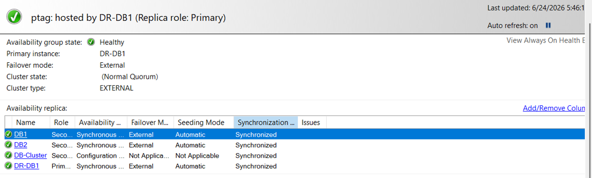


