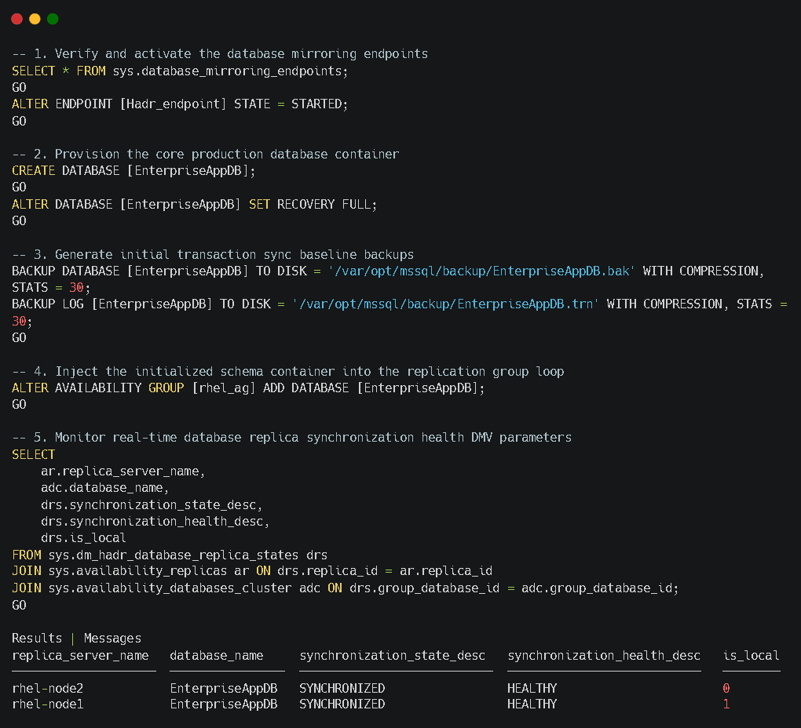

---

## 🔍 7. Post-Deployment Validation Queries

### Check AG Replica Synchronisation States
Run this metadata query window block to confirm active operational replication across nodes:
```sql
SELECT 
    ar.replica_server_name, 
    adc.database_name, 
    drs.synchronization_state_desc, 
    drs.synchronization_health_desc,
    drs.is_local
FROM sys.dm_hadr_database_replica_states drs
JOIN sys.availability_replicas ar ON drs.replica_id = ar.replica_id
JOIN sys.availability_databases_cluster adc ON drs.group_database_id = adc.group_database_id;
```


### Check Automatic Seeding Progress Status
Verify underlying auto-restoration transaction metrics:
```sql
SELECT 
    start_time, 
    completion_time, 
    current_state, 
    performed_seeding, 
    failure_state_desc
FROM sys.dm_hadr_automatic_seeding;
```
